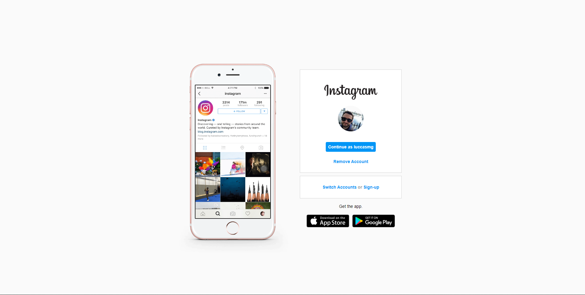

# Projeto Instagram Landing Page

   

<h4 align="center">✔️ <strong>Projeto Concluído</strong> 🚀</h4>

## 📋 Sobre o Projeto

O projeto foi desenvolvido durante o Bootcamp Santander Fullstack Developer com o objetivo de replicar a landing page do Instagram, utilizando as linguagens HTML e CSS, a fim de revisar e aplicar as principais propriedades aprendidas sobre Flexbox.

## 💻 Demonstração

Você pode acessar a <a href="https://luccasmg.github.io/projeto-instagram-lp/" target="_blank">versão final do projeto</a>.

## ✏️ Autor

| [ Luccas de Medeiros Gloria](https://github.com/luccasmg) |
| :---: |